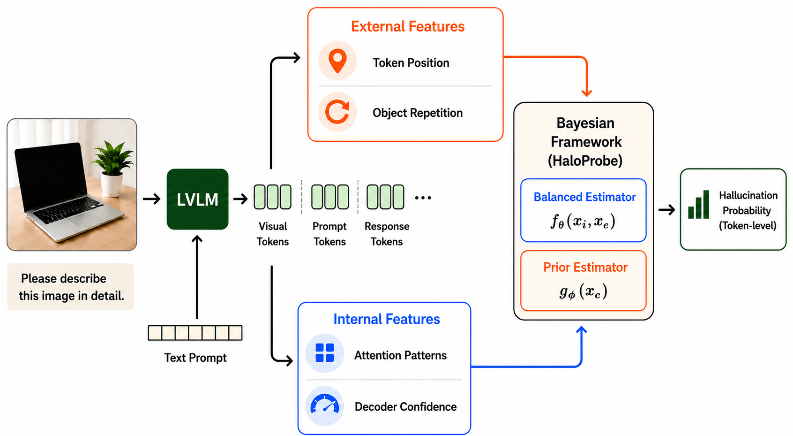
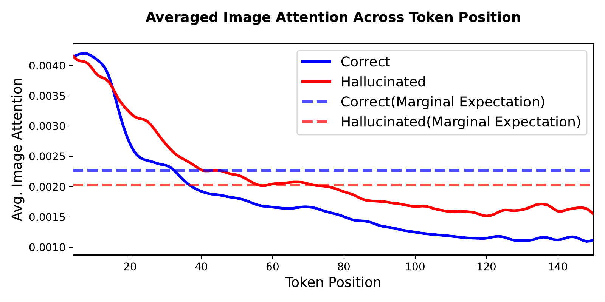
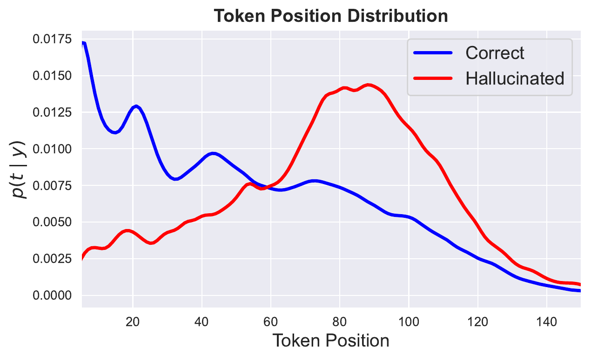
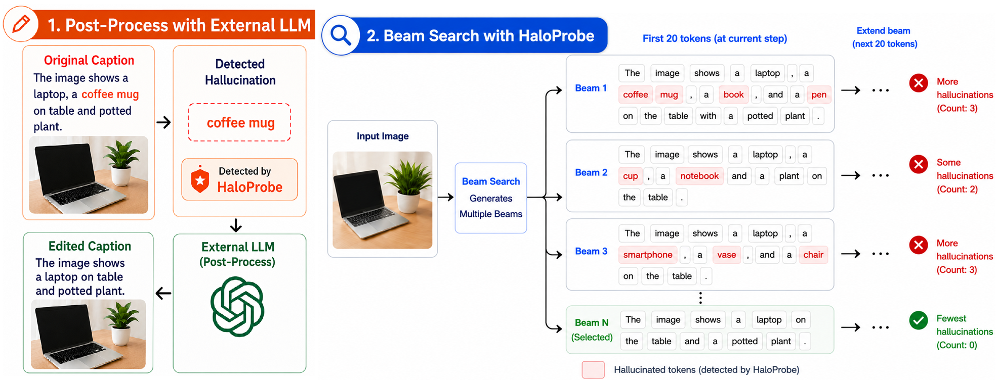
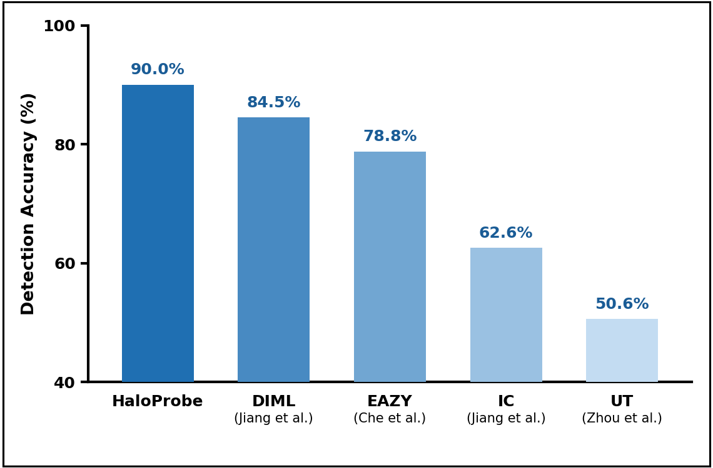
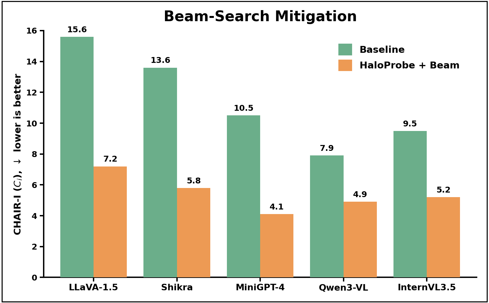
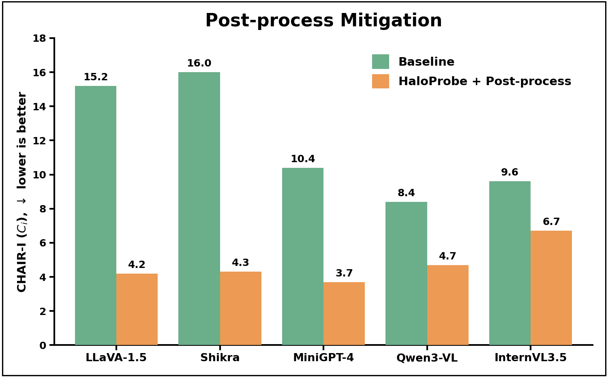
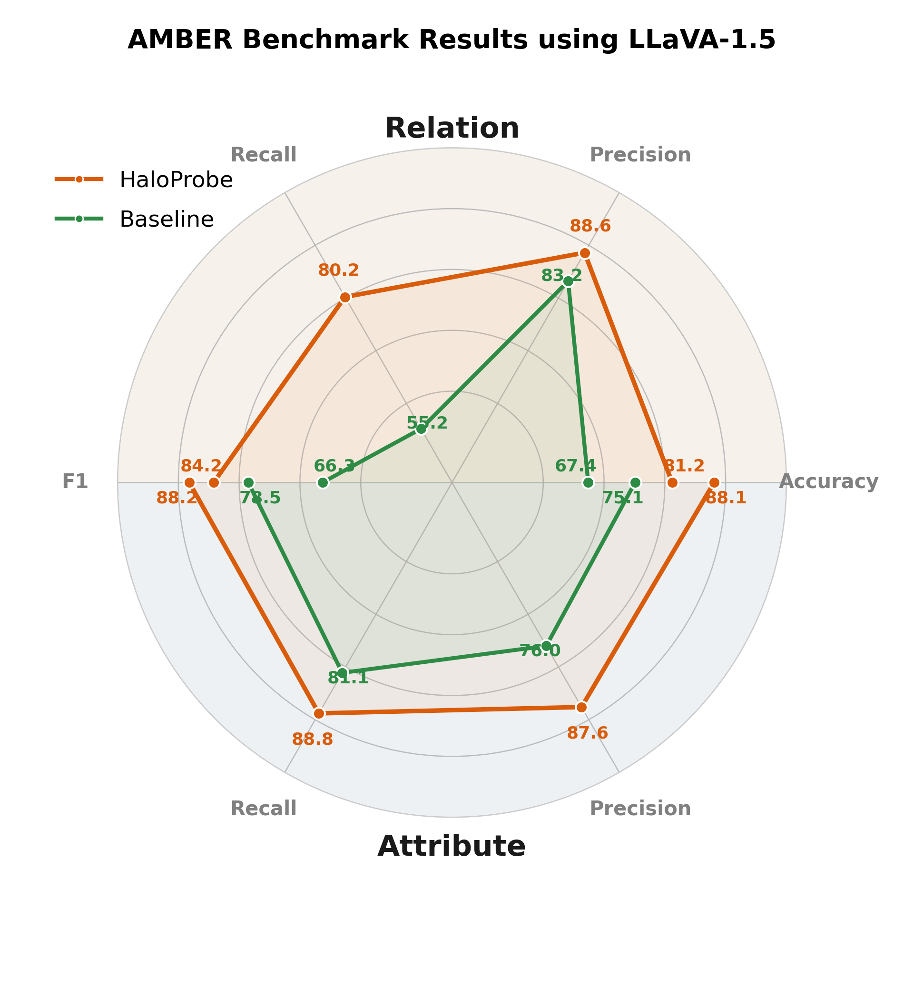

<h1 align="center">
HaloProbe: Bayesian Detection and Mitigation<br>of Object Hallucinations in Vision-Language Models
</h1>

<p align="center">
  Reihaneh Zohrabi<sup>*</sup> &middot; Hosein Hasani<sup>*</sup> &middot; Akshita Gupta &middot; Mahdieh Soleymani Baghshah &middot; Anna Rohrbach &middot; Marcus Rohrbach
</p>

<p align="center">
  <sup>*</sup> Equal contribution
</p>

<p align="center">
  <strong>ICML 2026</strong>
</p>

<p align="center">
  <a href="https://icml.cc/virtual/2026/poster/62157">ICML 2026</a> &middot;
  <a href="https://openreview.net/forum?id=jGRDp7Moik">OpenReview</a> &middot;
  <a href="https://arxiv.org/abs/2604.06165">arXiv:2604.06165</a>
</p>

<p align="center">
  <strong>Status:</strong> code release coming soon
</p>

---

## Overview

Large vision-language models (LVLMs) frequently produce **object hallucinations** — they
describe objects that are not present in an image — which limits their trustworthiness in
open-ended generation. A popular line of work treats a token's **image-attention** as a
signal for telling correct objects from hallucinated ones.

**HaloProbe** revisits this assumption and shows it is unreliable: coarse-grained,
attention-based analysis is distorted by hidden confounders (token position and object
repetition), producing a **Simpson's paradox** in which attention trends reverse or vanish
once statistics are aggregated. Building on this observation, HaloProbe is a **Bayesian
framework** that factorizes *external* caption statistics and *internal* decoding signals to
estimate **token-level hallucination probabilities**. These scores drive **non-invasive
mitigation** — HaloProbe never edits the model's internals — yet reduce hallucinations more
effectively than state-of-the-art intervention-based methods while preserving fluency and utility.

<p align="center">
  
</p>

<p align="center">
  <em>Given an image and prompt, an LVLM generates a caption. HaloProbe combines <strong>internal features</strong> (fine-grained attention and decoder-confidence statistics) with <strong>external features</strong> (token position and object repetition) through a balanced estimator and a prior estimator to produce token-level hallucination scores — enabling both reliable detection and downstream mitigation without modifying the model.</em>
</p>

## Key Insight: Attention Is Confounded

Prior work reports that correct objects receive **higher** image attention than hallucinated
ones. We show this conclusion is an artifact of aggregation. Two hidden confounders —
**token position** and **object occurrence / repetition** — induce **Simpson's paradox**:

- **Conditioned on token position**, hallucinated tokens often receive *comparable or higher*
  attention than correct ones (solid lines below).
- Yet **correct objects appear earlier** in captions while hallucinated objects drift to later
  positions (right plot). This different weighting flips the *marginal* expectation, making
  correct objects look higher-attention overall (dashed lines below).

<p align="center">
  
  
</p>

The takeaway: **globally averaged image attention is an unreliable hallucination signal.**
These external factors are not optional nuisances — ignoring them leads to wrong conclusions,
but naively conditioning on them invites shortcut learning (worsened by severe class
imbalance, where a trivial "always correct" classifier already exceeds 84% accuracy). HaloProbe
is designed to resolve exactly this tension.

## HaloProbe: A Bayesian Detection Framework

HaloProbe estimates the true token-level posterior $p(y \mid x_i, x_e)$ — where $y$ is the
correct/hallucinated label, $x_i$ are internal decoding features, and $x_e$ are external caption
features — by factorizing learning into two complementary estimators:

- **Balanced estimator $f_\theta(x_i, x_e)$** — trained on data *class-balanced with respect to
  external features*, so external cues can no longer act as shortcuts. This forces the model to
  extract discriminative evidence from **fine-grained, layer- and head-level attention** and
  decoder-confidence signals, and implicitly recovers a likelihood ratio over internal features.
- **Prior estimator $g_\phi(x_e)$** — trained on the natural, imbalanced distribution to capture
  how external signals alone correlate with hallucination.

A Bayesian correction recombines them into the true posterior:

$$p(y{=}1 \mid x_i, x_e) = \frac{f_\theta\, g_\phi}{f_\theta\, g_\phi + (1 - f_\theta)(1 - g_\phi)}$$

Intuitively, each estimator emits a distribution over the two classes; HaloProbe multiplies the
per-class probabilities and renormalizes. This retains the predictive value of easy external
features **through posterior correction rather than discarding them**, while remaining robust to
confounding and distribution shift.

## Non-Invasive Mitigation

Intervention-based methods reduce hallucinations by directly modifying model internals (e.g.,
amplifying image attention), but this pushes the model out of its normal operating regime and
often degrades fluency with repetition and unnatural phrasing. HaloProbe instead acts purely as
an **external scoring signal** on standard decoder outputs, in two flavors:

- **Hallucination-aware beam search** — expands candidates with the LVLM's standard decoding,
  then re-ranks each beam by its HaloProbe hallucination score, keeping the lowest-scoring
  candidate. Decoding itself is unchanged.
- **Post-process removal** — HaloProbe marks hallucinated objects in a generated caption, and an
  external LLM performs a single constrained edit that removes only the marked objects while
  preserving everything else.

<p align="center">
  
</p>

## Results

All experiments use MS&nbsp;COCO 2014 with the CHAIR evaluation framework. Detection and
mitigation are evaluated across **LLaVA-1.5, Shikra, MiniGPT-4**, and — to test generalization to
modern architectures — **Qwen3-VL** and **InternVL3.5**.

### Object Hallucination Detection

HaloProbe sets a new state of the art for token-level hallucination detection on LLaVA-1.5-7B,
improving over the prior best (DIML) by **+5.5 accuracy** and **+3.3 AUROC**.

| Method | Acc. ↑ | AUROC ↑ | Precision ↑ | Recall ↑ | F1 ↑ |
| --- | :---: | :---: | :---: | :---: | :---: |
| UT | 50.6 | – | 53.6 | 70.6 | 61.0 |
| IC | 62.6 | – | 61.9 | 81.6 | 70.4 |
| EAZY | 78.8 | – | 78.4 | 83.4 | 80.8 |
| DIML | 84.5 | 90.2 | – | 72.3 | – |
| **HaloProbe** | **90.0** | **93.5** | **92.5** | **95.8** | **94.1** |

<p align="center">
  
</p>

### Object Hallucination Mitigation

Guided only by HaloProbe scores, standard decoding reduces CHAIR — the instance-level metric
$C_i$ shown below (**lower is better**) — by a large margin across all five models, and does so
**without sacrificing F1**. On LLaVA-1.5, for example, nucleus-decoding $C_i$ drops from 15.2 to
4.2 while F1 improves (74.2 → 75.4).

<p align="center">
  
  
</p>

Against intervention-based beam-search methods such as OPERA and PAI at the same beam width, the
intervention-free strategy consistently produces fewer hallucinated objects — showing that
**modifying internal dynamics is not necessary**: an accurate probe over standard decoded outputs
is enough to surface fluent, well-grounded captions.

### Generalization Beyond Object Hallucination

On the AMBER benchmark (LLaVA-1.5), HaloProbe-guided generation improves attribute- and
relation-level metrics as well, indicating the framework generalizes beyond object hallucination.

<p align="center">
  
</p>

## Highlights

- **A confounding-aware view of attention.** We identify token position and object repetition as
  hidden confounders that induce Simpson's paradox, and show that globally averaged image
  attention is an unreliable signal for hallucination detection.
- **A factorized Bayesian detector.** HaloProbe disentangles internal model signals from external
  caption statistics via balanced training and posterior correction, achieving state-of-the-art
  token-level detection.
- **Non-invasive mitigation that preserves fluency.** HaloProbe-guided beam search and post-hoc
  editing outperform intervention-based methods on CHAIR while leaving the model's internals — and
  its generation quality — untouched.

## Code

The implementation (feature extraction, the balanced and prior estimators, and both mitigation
strategies) is being finalized and **will be released here soon**. Watch or star the repository
for updates.

## Citation

If you find this work useful, please cite:

```bibtex
@article{zohrabi2026haloprobe,
  title={HaloProbe: Bayesian Detection and Mitigation of Object Hallucinations in Vision-Language Models},
  author={Zohrabi, Reihaneh and Hasani, Hosein and Gupta, Akshita and Baghshah, Mahdieh Soleymani and Rohrbach, Anna and Rohrbach, Marcus},
  journal={arXiv preprint arXiv:2604.06165},
  year={2026}
}
```

## License

The license will be added together with the code release.
